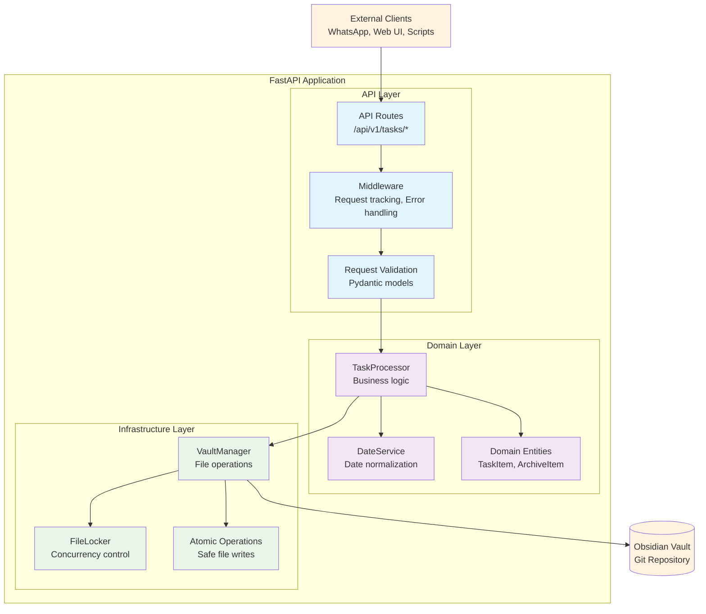

# Obsidian Task Automation API

**Phase 1 Development** - A FastAPI wrapper around existing Obsidian task automation scripts, with file locking and atomic operations for safe concurrent access.

## What This System Does

This API provides programmatic access to your existing Obsidian task automation workflows. It wraps your current task processing logic in REST endpoints, allowing external systems to trigger task operations while preserving data integrity through file locking.

**Current Status**: Core task operations are functional with proper concurrency protection. The system can safely process active and completed tasks, handle task queries, and maintain vault consistency.

**Planned Integration**: Future phases will add WhatsApp bot integration, Google Workspace synchronization, and automated batch processing via GitHub Actions.

## Architecture Overview

The system follows clean architecture principles with clear separation between API, domain logic, and infrastructure concerns:



## Current Implementation Status

**✅ Implemented and Working:**
- Task querying (list all tasks, get specific task)
- Task processing workflows (active and completed task processing)
- File locking system preventing concurrent modification conflicts
- Atomic file operations ensuring data consistency
- Health check endpoint with vault status verification
- Docker containerization with development and production configurations
- AWS infrastructure as code with Terraform
- Comprehensive error handling with structured responses
- Request tracking and logging middleware

**🚧 Work in Progress:**
- API authentication (middleware structure exists, implementation pending)
- Task creation and update endpoints (CRUD operations)
- Comprehensive test suite (structure in place, tests not written)
- Service layer architecture (partial implementation)

**📋 Planned for Future Phases:**
- WhatsApp bot integration for natural language task creation
- Google Workspace synchronization (Calendar, Gmail, Docs)
- GitHub Actions for automated batch processing
- Advanced monitoring and alerting integrations
- Enhanced logging configuration

## API Endpoints

### Currently Implemented
```
GET    /api/v1/tasks              # List all tasks (with optional filtering)
GET    /api/v1/tasks/{task_id}    # Get specific task details
POST   /api/v1/tasks/process-active    # Process all active tasks
POST   /api/v1/tasks/process-completed # Process completed tasks with retention
GET    /api/v1/health             # Health check with vault status
```

### Planned for Phase 2
```
POST   /api/v1/tasks              # Create new task (TODO)
PUT    /api/v1/tasks/{task_id}    # Update existing task (TODO)
DELETE /api/v1/tasks/{task_id}    # Delete task (TODO)
```

Each endpoint returns structured JSON responses with proper HTTP status codes, request tracking IDs, and detailed error information in development mode.

## Quick Start

### Using Docker (Recommended)
```bash
# Development setup with live reload
docker-compose up

# Production deployment
docker-compose -f docker-compose.prod.yml up
```

### Local Development
```bash
# Install dependencies
pip install -r requirements.txt
pip install -r requirements-dev.txt

# Configure vault path
export VAULT_PATH=/path/to/your/obsidian/vault

# Run the application
uvicorn app.src.main:app --reload

# Access the API documentation
open http://localhost:8000/docs
```

## Configuration

### Environment Variables
```bash
VAULT_PATH=/path/to/obsidian/vault    # Required: Path to your Obsidian vault
ENVIRONMENT=development               # development | production
LOG_LEVEL=INFO                       # DEBUG | INFO | WARNING | ERROR
API_KEY=your-secret-key              # Authentication key for API access
PORT=8000                            # Server port (defaults to 8000)
```

### Vault Settings
Edit `app/src/infrastructure/vault_settings.yaml`:
```yaml
tasks: "Tasks"                        # Folder for active tasks
completed_tasks: "Tasks/Completed"    # Folder for completed tasks
archive: "Knowledge Archive"          # Folder for archived projects
retent_for_days: 14                  # Days to retain completed tasks
```

## Task Data Model

The system works with markdown files containing YAML frontmatter. Here's the task structure:

```yaml
---
is_project: false
do_date: "2025-06-07"
due_date: "2025-06-10T17:00"
completed_at: ""
done: false
is_high_priority: true
repeat_task: "0 9 * * 1"  # Cron expression for weekly repeats
---

# Task Title

Task description and notes go here. This content becomes the task body.

- Subtasks can be included
- Links to other notes work normally
- All Obsidian features are preserved
```

## Development Workflow

### Code Quality Tools
```bash
# Run all pre-commit checks
pre-commit run --all-files

# Type checking
mypy app/src

# Code formatting
ruff format app/

# Security scanning
bandit -r app/src
```

### Testing
```bash
# TODO: Tests are not yet implemented
# Test structure is in place but test files are empty
# pytest --cov=app/src app/tests/

# Current test structure:
# app/tests/unit/      (empty)
# app/tests/integration/   (empty)
```

### Infrastructure Management
```bash
# Deploy to production
cd infrastructure/terraform/environments/prod
terraform init
terraform plan
terraform apply

# Validate infrastructure changes
cd infrastructure/terraform
tflint --recursive
tfsec .
```

## Production Deployment

### AWS Infrastructure
The included Terraform configuration provides:
- **EC2 instances** with security groups and SSH access
- **VPC networking** with public subnets and internet gateways
- **Cost optimization** through instance scheduling and budget alerts
- **Security hardening** with encrypted volumes and IMDSv2

### Cost Management
- **Development:** t3.micro instance (~€8.50/month)
- **Production:** t3.small instance (~€17/month)
- **Storage:** 20GB EBS GP3 (~€1.60/month)
- **Total estimated cost:** ~€30/month well under budget constraints

### Deployment Process
```bash
# Build and deploy container
docker build -t obsidian-automation .
docker tag obsidian-automation:latest your-registry/obsidian-automation:latest
docker push your-registry/obsidian-automation:latest

# Deploy infrastructure
terraform apply -var-file="terraform.tfvars"

# Verify deployment
curl https://your-domain/api/v1/health
```

## Concurrency and Data Safety

The system implements comprehensive concurrency protection:

**File Locking:** Every file operation acquires exclusive locks to prevent simultaneous modifications from corrupting data or creating merge conflicts.

**Atomic Operations:** File writes use temporary files with atomic replacement, ensuring that operations either complete fully or leave no partial changes.

**Retry Logic:** Failed operations automatically retry with exponential backoff, handling transient issues like network interruptions or temporary file locks.

**Error Recovery:** Comprehensive exception handling ensures that failed operations are logged, temporary files are cleaned up, and the system remains in a consistent state.

## Integration Capabilities

The architecture is designed for easy extension with external systems:

**📋 Planned Integrations (Future Phases):**
- **WhatsApp Integration:** Natural language task creation via webhook endpoints that parse messages and create properly formatted tasks
- **Google Workspace:** Sync with Google Calendar for due dates, Gmail for task creation from emails, and Google Docs for project documentation
- **Custom Workflows:** The current REST API enables integration with any system that can make HTTP requests

**✅ Current Integration Points:**
- REST API for programmatic task management
- Docker containers for easy deployment
- Git-based vault storage for version control integration

## Security Considerations

**🚧 Currently Implemented:**
- Input validation through Pydantic models prevents injection attacks
- File system access restricted to configured vault directory
- Application runs with minimal privileges in Docker containers
- Network security via AWS security groups (production deployment)

**📋 Authentication (TODO):**
- API key-based authentication planned but not yet implemented
- Middleware structure exists in codebase but needs activation
- Currently operates without authentication (development only)

## Monitoring and Observability

**✅ Currently Implemented:**
- Health endpoints verify vault accessibility, file system status, and Git repository integrity
- Request tracking with unique identifiers flowing through all log messages
- Structured logging framework with contextual information
- Basic error handling and exception translation

**🚧 Monitoring Hooks (Partial):**
- Alert system structure exists but integrations not configured
- CloudWatch integration planned for production deployment
- Error alerting framework ready but needs service connections

**📋 TODO - External Integrations:**
- Slack/email alert integrations
- Advanced monitoring dashboards
- Performance metrics collection
- Distributed tracing capabilities

## Contributing

**Code Standards:** The project uses pre-commit hooks for automated code quality checks including formatting, linting, type checking, and security scanning.

**Architecture Decisions:** Significant changes should follow the established clean architecture patterns with clear separation between API, domain, and infrastructure concerns.

**Testing Requirements:** New features require both unit tests for business logic and integration tests for API endpoints.

**Documentation:** Update relevant documentation including API schemas, configuration examples, and architectural decision records.

## License

MIT License - See [LICENSE](LICENSE) for details.

## Troubleshooting

**Vault Path Issues:** Ensure the `VAULT_PATH` environment variable points to a valid Obsidian vault directory with `.git` initialization.

**File Permission Errors:** Verify the application has read/write permissions to the vault directory and can create temporary files.

**Lock Timeout Errors:** If you see concurrency errors, check for processes that might be holding file locks or increase the timeout settings.

**Git Integration Problems:** Ensure the vault directory is a valid Git repository with proper remote configuration if you need Git synchronization features.
