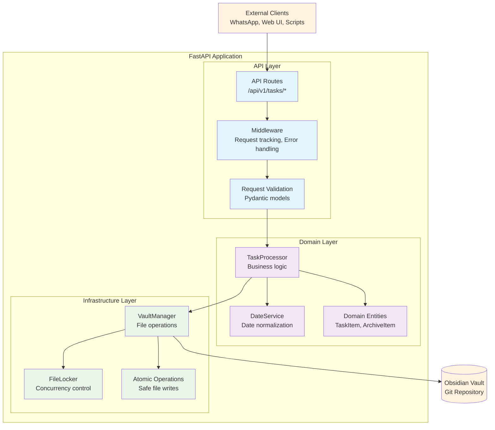

# Obsidian Task Automation API
## Project Vision

**Create an automated task management system and personal knowledge archive that simulates a personal assistant.** Built on markdown files, the system leverages proven productivity methodologies (GTD, BASB) and integrates with daily tools (messaging, calendar, email) to help users be more effective and reduce mental load.

## What This System Does

This API provides programmatic access to your existing Obsidian task automation workflows. It wraps your current task processing logic in REST endpoints, allowing external systems to trigger task operations while preserving data integrity through file locking.

## 🚀 Project Status

```
✅ Phase 1 Development - COMPLETED
   ├── Task processing and querying endpoints
   ├── File locking and atomic operations
   ├── Authentication and rate limiting
   ├── Docker containerization
   ├── AWS infrastructure as code
   └── Production deployment pipeline

🔄 Testing Framework and Test Coverage - IN PROGRESS
   ├── Test environment architecture
   ├── Mock infrastructure layer
   ├── Unit and integration test suites
   └── End-to-end testing framework

📋 Phase 1 Refactoring - NEXT IN LINE
   ├── Code cleanup and TODO elimination
   ├── Full CRUD operations implementation
   ├── Performance optimization
   └── Security audit and hardening

🔮 Phase 2 - AFTER REFACTOR COMPLETED
   ├── WhatsApp bot integration
   ├── Google Workspace synchronization
   ├── GitHub Actions automation
   └── Advanced monitoring
```

## Architecture Overview

The system follows clean architecture principles with clear separation between API, domain logic, and infrastructure concerns:



## Implementation Status

**✅ Phase 1 Development (Completed):**
- Task querying (list all tasks, get specific task)
- Task processing workflows (active and completed task processing)
- File locking system preventing concurrent modification conflicts
- Atomic file operations ensuring data consistency
- Health check endpoint with vault status verification
- API authentication and rate limiting middleware
- Comprehensive error handling with structured responses
- Request tracking and logging middleware
- Docker containerization with development and production configurations
- AWS infrastructure as code with Terraform
- Production deployment pipeline via GitHub Actions
- Security hardening (encrypted volumes, IMDSv2, restricted access)

**🔄 Testing Framework and Test Coverage (In Progress):**
- Test environment architecture design
- Mock infrastructure layer development
- Unit test suite implementation
- Integration test framework setup

**📋 Phase 1 Refactoring (Next in Line):**
- Code cleanup and TODO elimination
- Full CRUD operations implementation (POST, PUT, DELETE)
- Performance optimization and monitoring
- API documentation completion
- Security audit and hardening

## API Endpoints

### Current Implementation
```
GET    /api/v1/tasks/                   # List all tasks (with optional filtering)
GET    /api/v1/tasks/{task_id}          # Get specific task details
POST   /api/v1/tasks/process-active     # Process all active tasks
POST   /api/v1/tasks/process-completed  # Process completed tasks with retention
GET    /api/v1/health                   # Health check with vault status
```

### Planned for Refactoring Phase
```
POST   /api/v1/tasks/             # Create new task
PUT    /api/v1/tasks/{task_id}    # Update existing task
DELETE /api/v1/tasks/{task_id}    # Delete task
```

Each endpoint returns structured JSON responses with proper HTTP status codes, request tracking IDs, and detailed error information in development mode.

## Quick Start

### Using Docker (Recommended)
```bash
# Development setup with live reload
docker-compose up

# Production deployment
docker-compose -f docker-compose.prod.yml up
```

### Local Development
```bash
# Install dependencies
pip install -r requirements.txt
pip install -r requirements-dev.txt

# Configure vault path
export VAULT_PATH=/path/to/your/obsidian/vault

# Run the application
uvicorn app.src.main:app --reload

# Access the API documentation
open http://localhost:8000/docs
```

## Configuration

### Environment Variables
```bash
VAULT_PATH=/path/to/obsidian/vault    # Required: Path to your Obsidian vault
ENVIRONMENT=development               # development | production
LOG_LEVEL=INFO                       # DEBUG | INFO | WARNING | ERROR
API_KEYS=key1,key2,key3              # Comma-separated API keys for authentication
PORT=8000                            # Server port (defaults to 8000)
```

### Vault Settings
Edit `app/src/infrastructure/vault_settings.yaml`:
```yaml
tasks: "Tasks"                        # Folder for active tasks
completed_tasks: "Tasks/Completed"    # Folder for completed tasks
archive: "Knowledge Archive"          # Folder for archived projects
retent_for_days: 14                  # Days to retain completed tasks
```

## Task Data Model

The system works with markdown files containing YAML frontmatter.
The filename is the also the task title, and the structure is following this example:

```yaml
---
is_project: false
do_date: "2025-06-07"
due_date: "2025-06-10T17:00"
completed_at: ""
done: false
is_high_priority: true
repeat_task: "0 9 * * 1"  # Cron expression for weekly repeats
---

Task description and notes go here. This content becomes the task body.

- Subtasks can be included
- Links to other notes work normally
- All Obsidian features are preserved
```

## Development Workflow

### Code Quality Tools
```bash
# Run all pre-commit checks
pre-commit run --all-files

# Type checking
mypy app/src

# Code formatting
ruff format app/

# Security scanning
bandit -r app/src
```

### Testing
```bash
# Run test suite (when implementation is complete)
pytest --cov=app/src app/tests/

# Current testing framework development:
# app/tests/unit/      (framework in development)
# app/tests/integration/   (framework in development)
```

### Infrastructure Management
```bash
# Deploy to production
cd infrastructure/terraform/environments/prod
tofu init
tofu plan
tofu apply

# Validate infrastructure changes
cd infrastructure/terraform
tflint --recursive
tfsec .
```

## Production Deployment

### AWS Infrastructure
The included Terraform configuration provides:
- **EC2 instances** with security groups and SSH access
- **VPC networking** with public subnets and internet gateways
- **Security hardening** with encrypted volumes and IMDSv2

### Deployment Process
```bash
# Automated deployment via GitHub Actions
git push origin main

# Manual deployment
docker build -t obsidian-automation .
docker tag obsidian-automation:latest your-registry/obsidian-automation:latest
docker push your-registry/obsidian-automation:latest

# Deploy infrastructure
tofu apply -var-file="terraform.tfvars"

# Verify deployment
curl https://your-domain/api/v1/health
```

## Concurrency and Data Safety

The system implements comprehensive concurrency protection:

**File Locking:** Every file operation acquires exclusive locks to prevent simultaneous modifications from corrupting data or creating merge conflicts.

**Atomic Operations:** File writes use temporary files with atomic replacement, ensuring that operations either complete fully or leave no partial changes.

**Retry Logic:** Failed operations automatically retry with exponential backoff, handling transient issues like network interruptions or temporary file locks.

**Error Recovery:** Comprehensive exception handling ensures that failed operations are logged, temporary files are cleaned up, and the system remains in a consistent state.

## Integration Capabilities

The architecture is designed for easy extension with external systems:

**✅ Current Integration Points:**
- REST API for programmatic task management
- Docker containers for easy deployment
- Git-based vault storage for version control integration
- AWS cloud infrastructure integration

**📋 Planned Integrations (Phase 2):**
- **WhatsApp Integration:** Natural language task creation via webhook endpoints
- **Google Workspace:** Sync with Google Calendar for due dates, Gmail for task creation from emails
- **Custom Workflows:** Enhanced automation via GitHub Actions and external webhooks

## Security Features

**✅ Implemented Security:**
- API key-based authentication with rate limiting
- Input validation through Pydantic models prevents injection attacks
- File system access restricted to configured vault directory
- Application runs with minimal privileges in Docker containers
- Network security via AWS security groups and VPC isolation
- Encrypted storage and secure secret management

**🔄 Security Hardening (Backlog):**
- Security audit and penetration testing
- Enhanced logging and monitoring
- Secrets rotation automation

## Monitoring and Observability

**✅ Current Monitoring:**
- Health endpoints verify vault accessibility, file system status, and Git repository integrity
- Request tracking with unique identifiers flowing through all log messages
- Structured logging framework with contextual information
- Comprehensive error handling and exception translation

**📋 Enhanced Monitoring (Phase 2):**
- CloudWatch integration for production metrics
- Slack/email alert integrations
- Advanced monitoring dashboards
- Performance metrics collection and alerting

## License

MIT License - See [LICENSE](LICENSE) for details.

## Troubleshooting

**Vault Path Issues:** Ensure the `VAULT_PATH` environment variable points to a valid Obsidian vault directory with `.git` initialization.

**File Permission Errors:** Verify the application has read/write permissions to the vault directory and can create temporary files.

**Lock Timeout Errors:** If you see concurrency errors, check for processes that might be holding file locks or increase the timeout settings.

**Git Integration Problems:** Ensure the vault directory is a valid Git repository with proper remote configuration if you need Git synchronization features.

**Authentication Issues:** Verify API keys are properly configured in environment variables or AWS Secrets Manager for production deployments.
